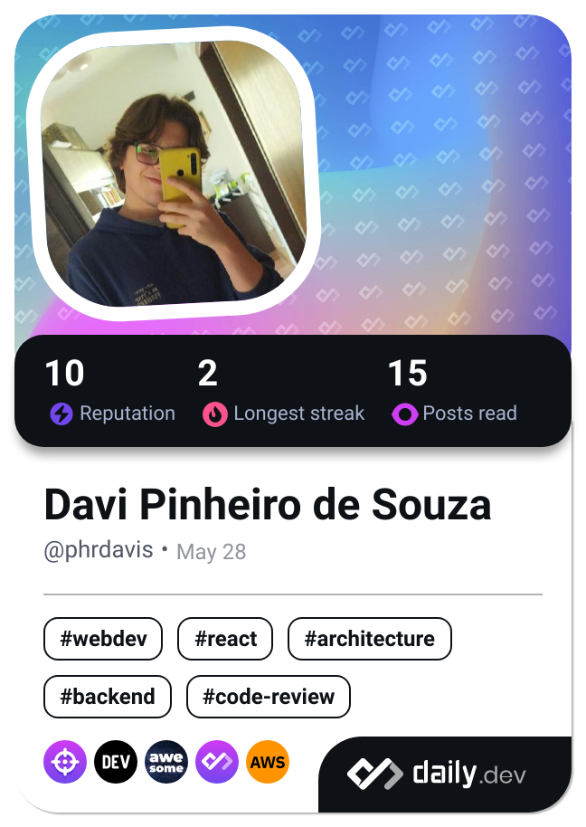

  <h1>Hello Folks!</h1>
  
Me chamo <strong>Davi Pinheiro de Souza</strong>, tenho 22 anos. Sou estudante de Engenharia de Software e podemos dizer que sou apaixonado por programação, jogos, doguinhos e gatitos⤠

  

    
    
  

  

     
    <h3>🤖Minhas Tecnologias e Ferramentas:</h3>
    

     
      
    

  

   
  
😱 Atualmente trabalho como <strong>Desenvolvedor Web </strong> utilizando <strong>Bootstrap, PHP e MySQL</strong>;

  
🧑‍💻 Venho estudando <strong>C# e .NET</strong> para me especializar em Back-End;

  
🔛 Sou muito fã de <strong>Java</strong> e procuro me especializar cada vez mais em <strong>Programação Orientada a Objetos</strong>;

  
⌛️ Atualizo meu <a href="https://phrdavis.github.io/" target = "_blank">Portifólio Online</a> com frequência para que todos possam ver meu trabalho, mesmo que ainda esteja em fase de desenvolvimento (Atualmente esta na versão 2.0 hehe);

  
☕ Adoro um <strong>cafézinho</strong> e <strong>jogos em geral</strong> para descontrair e juntar meus amigos!

    
  <h3>🏅 Meus próximos desafios</h3>
  

    

       
      - C# 
    

    

       
      - .NET
    

    

       
      - C++
    

  

   
   
  
🔥 Você pode entrar em contato comigo pelo <a href="https://www.instagram.com/davip27/" target = "_blank">Instagram</a>, <a href="mailto:davipinheiro.dev@gmail.com?subject=Contact via Github Readme&body=Olá, tudo bem? Acessei seu GitHub e gostaria de entrar em contato!" target = "_blank">E-mail</a> ou <a href="https://www.linkedin.com/in/phrdavis/" target = "_blank">Linkedin</a> vou tentar responder o quanto antes e por favor, fique a vontade para conhecer meus projetos aqui do GitHub😄

  <h3>🌐Links para as minhas redes sociais:</h3>
  
  
  
  <a href=mailto:davipinheiro.dev@gmail.com>
  
    

  

  ##
   
 

  
  

  ##
  
  

  

